#  1 JVM与Java体系结构

## 1.1 Java：跨平台的语言

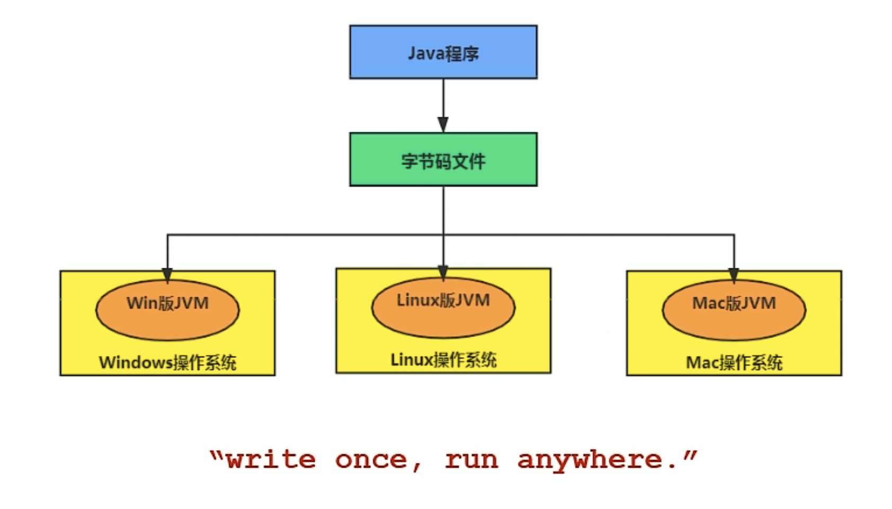

Groovy、Scala、JRuby、Kotlin等都是Java平台的一部分

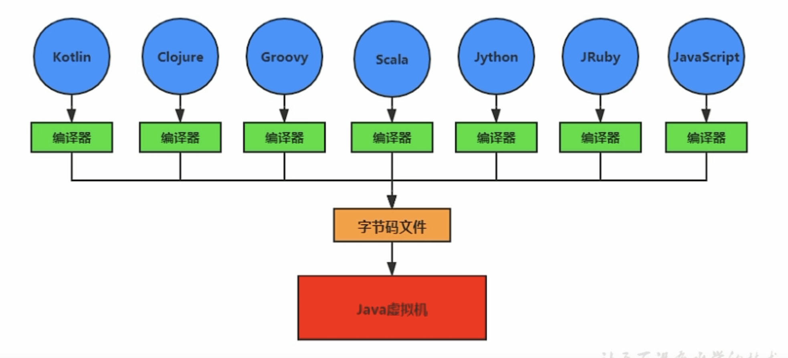

**Java不是最强大的语言，但是JVM是最强大的虚拟机**

## 1.2 字节码

* 我们平时说的java字节码，指的是用java语言编译成的字节码。准确的说任何能在jvm平台上执行的字节码格式都是一样的。所以应该统称为：jvm字节码。
* 不同的编译器，可以编译出相同的字节码文件，字节码文件也可以在不同的JVM上运行
* Java 虚拟机与 Java 语言并没有必然的联系，它只与特定的二进制文件格式—Class文件格式所关联，Class 文件中包含了 Java 虚拟机指令集（或者称为字节码、Bytecodes）和符号表，还有一些其他辅助信息。

## 1.3 多语言混合编程

​		Java平台上的多语言混合编程正成为主流，通过特定领域的语言去解决特定领域的问题是当前软件开发应对日趋复杂的项目需求的一个方向。
​		试想一下，在一个项目之中，并行处理用`Clojure`语言编写，展示层使用`JRuby/Rails`，中间层则是`Java`，每个应用层都将使用不同的编程语言来完成，市且，接口对每一层的开发者都是透明的，各种语言之间的交互不存在任何何困难，就像使用自己语言的原生`API`一样方便，因为它们最终都运行在-虛拟机之上。
​		对这些运行于`Java`虛拟机之 上、Java`之外的语言`，来自系统级的、底层的支持正在迅速增强，以`JSR-292`为核心的一系列项目和功能改进（如`DaVinci Machine`项日、`Nashorn`引擎、`InvokeDynamic`指令、`java.lang.invoke`包等），推动`Java`虚拟机从
“`Java`语言的虚拟机”向“名语言虛拟机”的方向发展。

## 1.4 虚拟机与Java虚拟机

所谓虚拟机 (`Virtual Machine`)，就是一台虛拟的计算机。它是一款软件，用来执行一系列虛拟计算机指令。大体上，虚拟机可以分为系统虚拟机和程序虛拟机。

* **系统虚拟机**：大名鼎鼎的`Visual Box`,`Vware`就属于系统虛拟机，它们完全是对物理计算机的仿真，提供了一个可运行完整操作系统的软件平台
* **程序虚拟机**：程序虛拟机的典型代表就是`Java`虛拟机，它专门为执行单个计算机程序而设计，在Java虛拟机中执行的指令我们称为Java字节码指令

无论是系统虛拟机还是程序虛拟机，在上面运行的软件都被限制于虛拟机提供的资源中

### Java虚拟机

* `Java`虛拟机是-一台执行`Java`宇节码的虛拟计算机，它拥有独立的运行机制，其运行的Java字节码也未必由`Java`语言编译而成。
* `JVM`严台的各种语言可以共享`Java`虛拟机带来的跨平台性、优秀的垃圾回器，以及可靠的即时编译器。
* **`Java`技术的核心就是`Java`虚拟机**（`JVM`,`Java Virtual Machine`)，因为所有的`Java`程序都运行在`Java`虚拟机内部。

**作用**

`Java`虚拟机就是二进制字节码的运行环境，负责装载宇节码到其内部，解释/编译为对应平台上的机器指令执行。每一条`Java`指令，`Java`虛拟机规范中都有详细定义，如怎么取操作数，怎么处理操作数，处理结果放在哪里。

**特点**

* 一次编译，到处运行
* 自动内存管理
* 白动垃圾回收功能


### JVM的位置

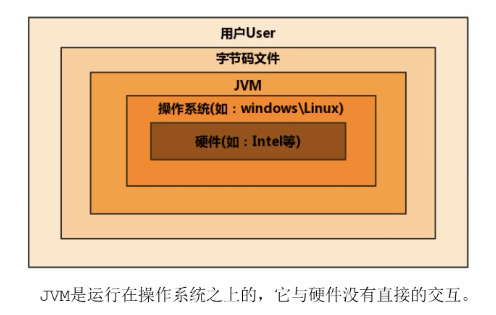

`JDK`中的概述：

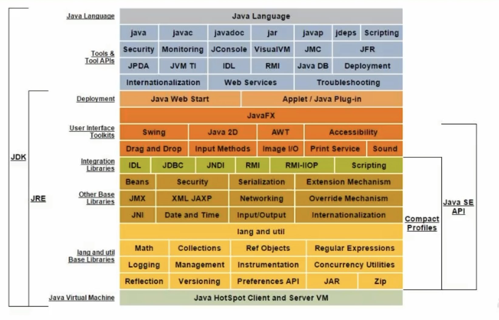


### JVM的整体结构

* `Hotspot VM`是目前市面上高性能虛拟机的代表作之一。
* 它采用解释器与即时编译器并存的架构。
* 在今天，`Java`程序的运行性能早己脱胎换骨，己经达到了可以和`C/C++`程序一较高下的地步。

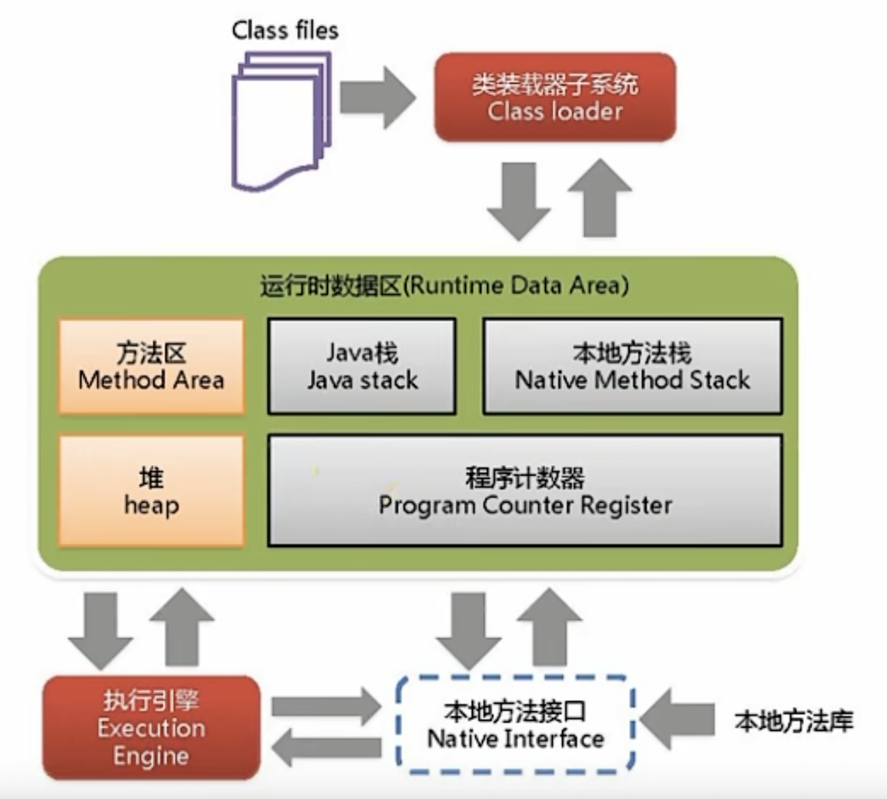

详细图：

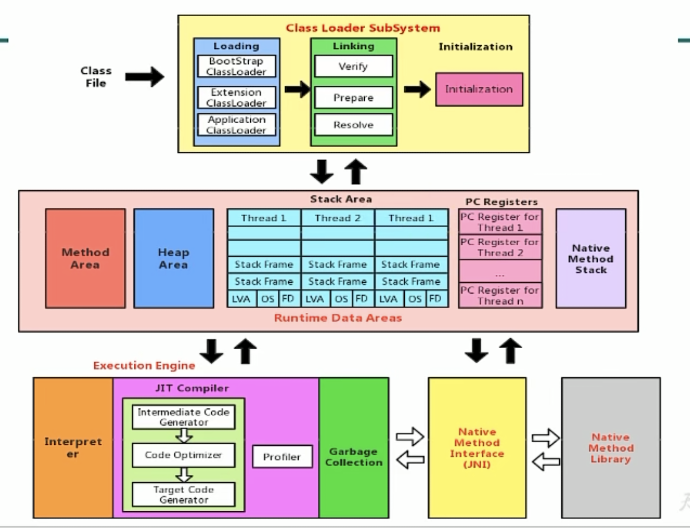


### Java代码执行流程

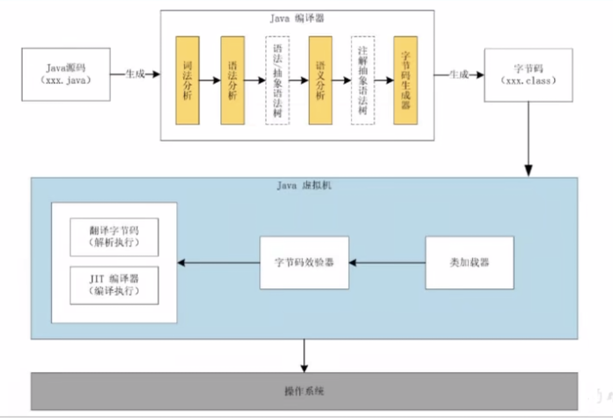


### JVM的架构模型

Java编译器输入的指令流基本上是一种基于栈的指令集架构，另外一种指令集架构则是基于寄存器的指令集架构。

具体来说：这两种架构之间的区别：

* 基于**栈式架构**的特点
  * 设计和实现更简单，适用于资源受限的系统；
  * 避开了容存器的分配难题：使用零地址指令方式分配。
  * 指令流中的指令大部分是零地址指令，其执行过程依赖于操作栈。指令集更小，编译器容易实现。
  * 不需要硬件支持，可移植性更好，更好实现跨平台
* 基于**寄存器架构**的特点
  * 典型的应用是x86的二进制指令集：比如传统的PC以及Android的Davlik虚
    拟机。
  * 指令集架构则完全依赖硬件，可移植性差
  * 性能优秀和执行更高效；
  * 花费更少的指令去完成一项操作
  * 在大部分情况下，基于寄存器架构的指令集往往都以一地址指令、二地址指令和三地址指令为主，市基于栈式架构的指令集却是以零地址指令为主。

**总结**
		由于跨平台性的设计，Java的指令都是根据栈来设计的。不同平台CPU架构不同，所以不能设计为基于奇存器的。优点是跨平台，指令集小，编译器容易实现，缺点是性能下降，实现同样的功能需要更多的指令。
		时至今日，尽管嵌入式平台已经不是Java程序的主流运行平台了（准确来说应该是HotspotvM 的宿主环境己经不局限于嵌入式平台了），那么为什么不将架构更换为基于寄存器的架构呢？


### JVM的生命周期

启动 - 执行 - 退出

* **启动**
  Java虚拟机的启动是通过引导类加载器 (bootstrap class loader)创建一个初始类(initial class） 来完成的，这个类是由虚拟机的具体实现指定的。

* **执行**

  * —个运行中的Java虛拟机有着一个清哳的任务：执行Java程序。

  * 程序开始执行时他才运行，程序结束时他就停止。

  * 执行一个所谓的Java程序的时候，真真正正在执行的是一个叫做**Java虚拟机的进程**。
    ```java
    // Java命令： jps （打印程序正在执行中的进程）
    jps
    ```

* **退出**

  * 程序正常执行结束

  * 程序在执行过程中遇到了异常或错误而异常终止

  * 由于操作系统出现错误而导致Java虛拟机进程终止

  * 某线程调用Runtime 类或system类的exit方法，或 Runtime类的halt方法，并且Java安全管理器也允许这次exit或halt操作。
    ```java
    // 可以跟一下Runtime或System的源码
    java.lang.System
    java.lang.Runtime // 关联想到虚拟机结构里的运行时数据区（Runtime Data Area）
    ```

  * 除此之外，JNI ( Java Native Interface)规范描述了用JNI Invocation API来加载或卸载 Java虛拟机时，Java虛拟机的退出情况。


### 常见的Java虚拟机

* **Sun Classic VM**
  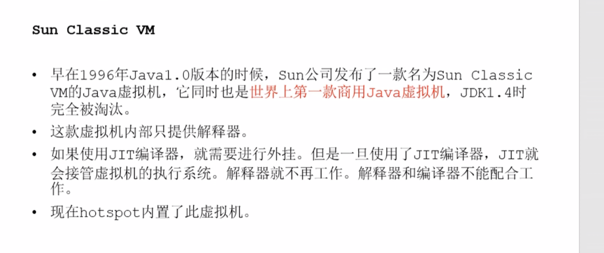

* Exact VM
  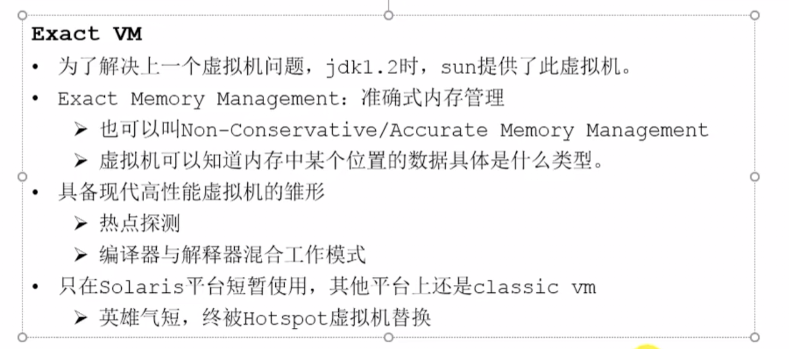

* **HotSpot VM （SUN）**
  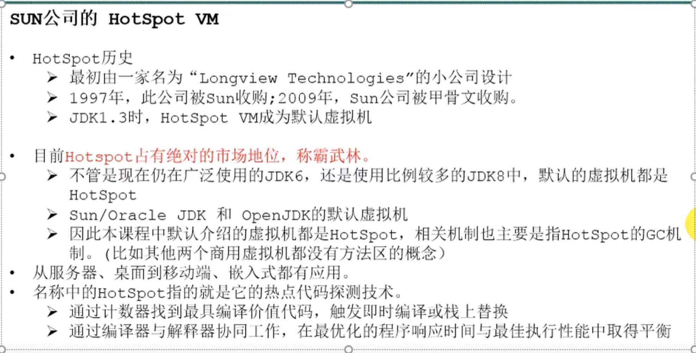

* **JRocket （BEA）**
  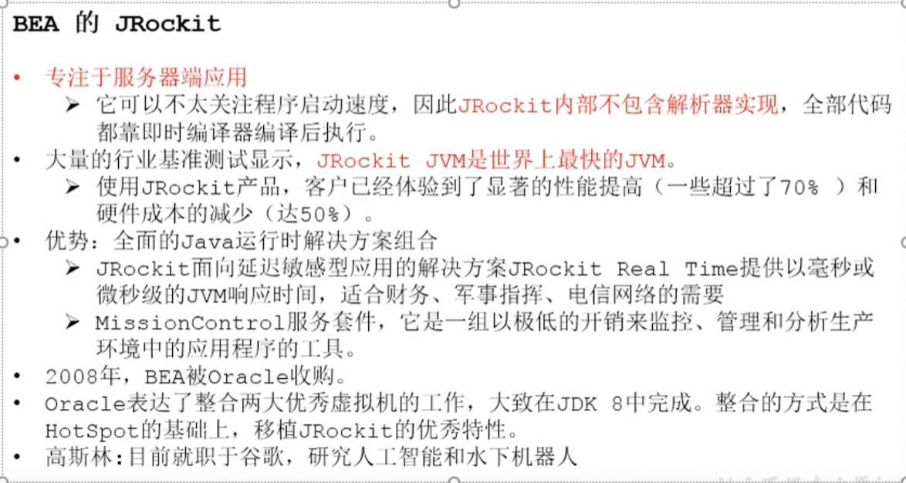


  **MissionControl服务套件非常有价值，后被整合到比如 JDK Mission Control（JMC）中，主要用于监控内存泄漏**

* **J9（IBM）**
  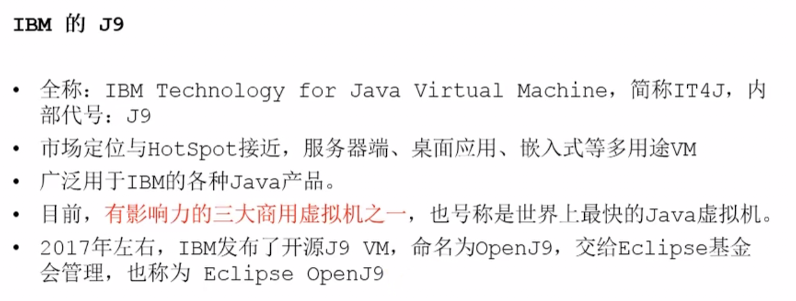

* **TaobaoJVM （阿里巴巴）**
  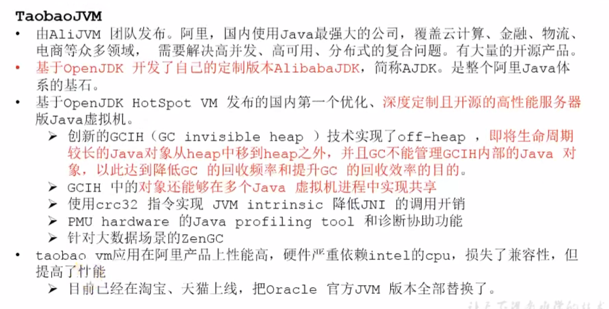

* Dalvik VM（不是Java虚拟机的虚拟机）
  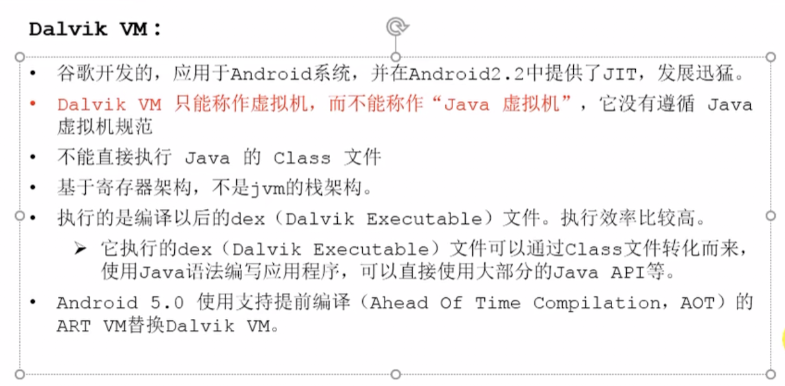

* **Graal VM （Oracle）**
  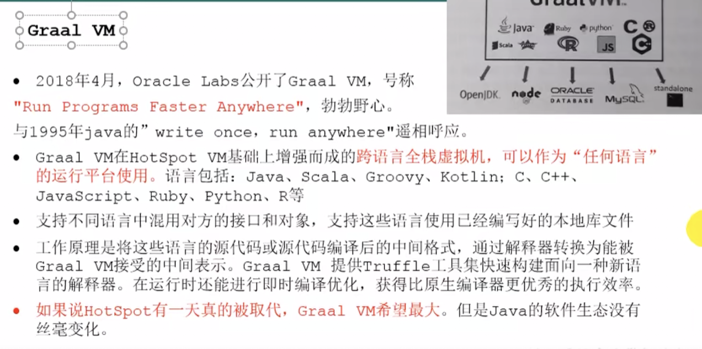


# 2 内存结构概述

简图：

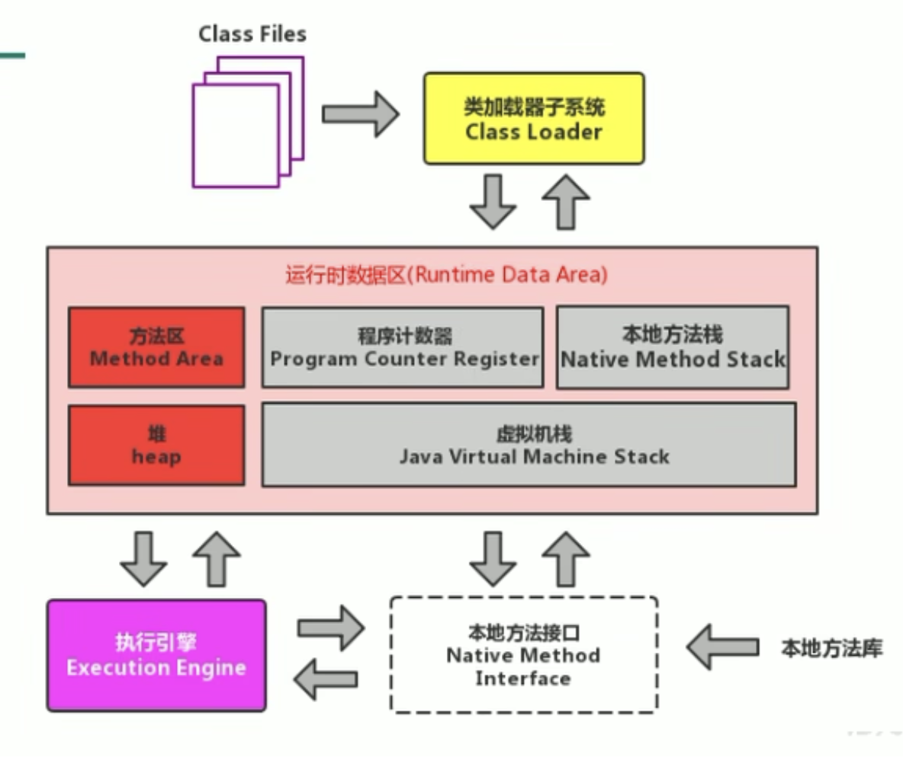

详情图：

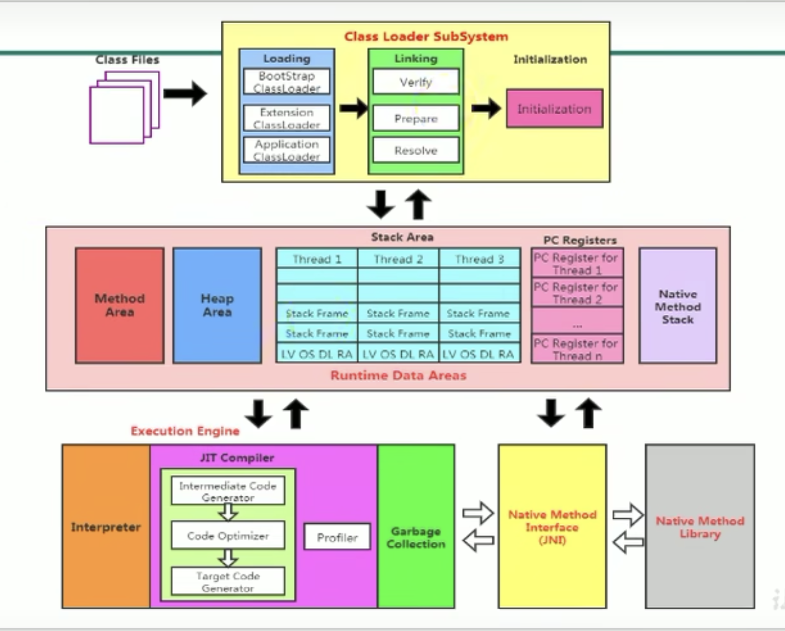

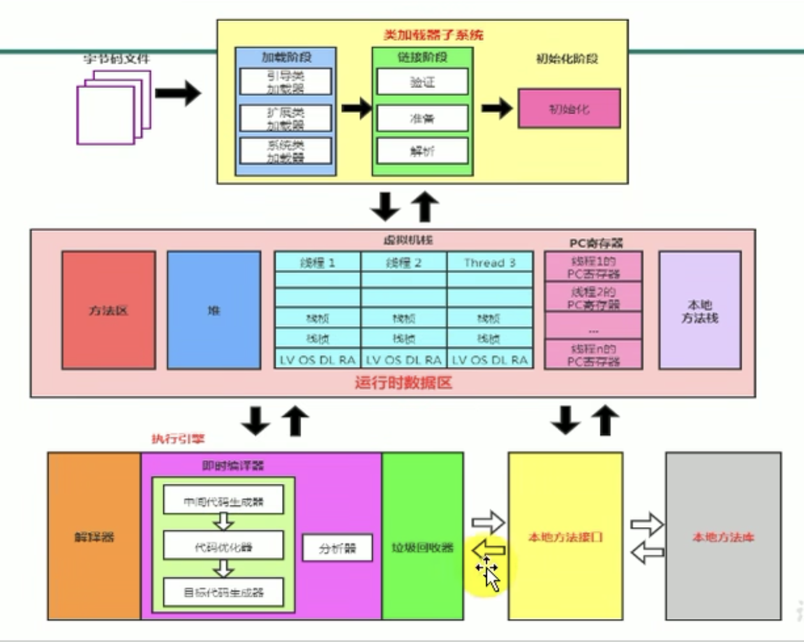


# 3 类的加载器及类加载过程

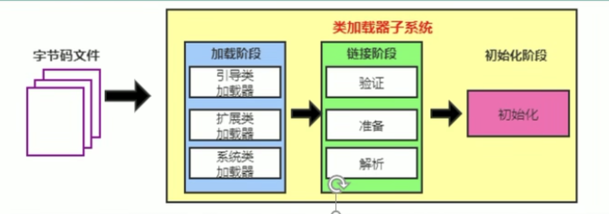

* 类加载器子系统负责从文件系统或者网络中加载Class文件，class文件在文件开头有特定的文件标识，标识为：`cafe babe`。eg. 打开一个.class文件：
  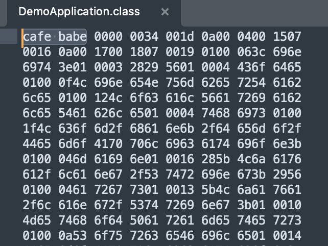
* ClassLoader只负责class文件的加载，至于它是否可以运行，则由ExecutionEngine决定。
* 加载的类信息存放于一块称为**方法区**的内存空间。除了类的信息外，方法区中还会
  存放运行时常量池信息，可能还包括字符串字面量和数字常量（这部分常量信息是
  Class文件中常量池部分的内存映射）

**举例说明类加载器加载类的过程：**

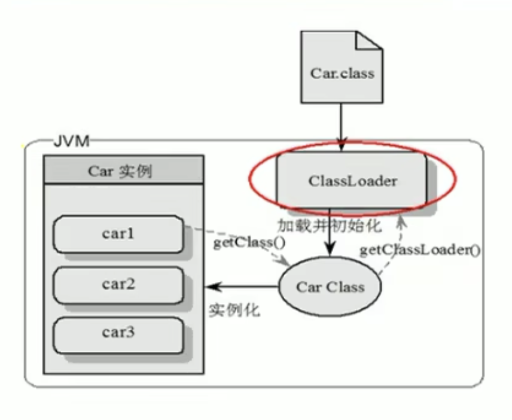

1. class file 存在于本地硬盘上，可以理解为设计师画在纸上的模板，而最终这个模板在执行的时候是要加载到JVM当中水
根据这个文件实例化出口个一模一样的实例。
2. class file 加载到JVM中，被称为DNA元数据模板，放在方法区。
3. 在.class文件一＞JVM ->最终成为元数据模板，此过程就要一个运输工具（类装载器 Class Loader），扮演-一个快递员的角色。


## 3.1 类加载过程

加载 --> 验证、准备、解析 --> 初始化

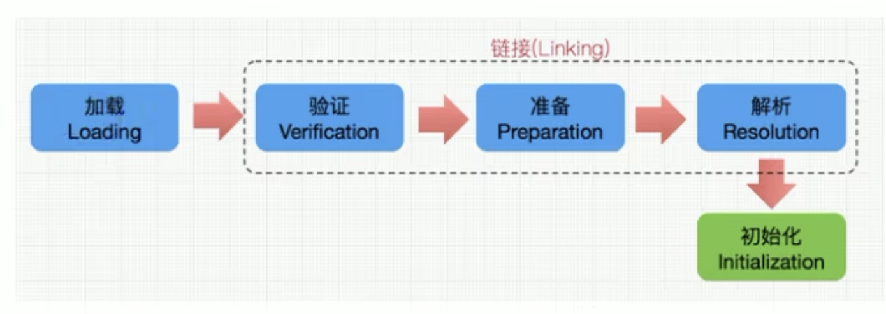

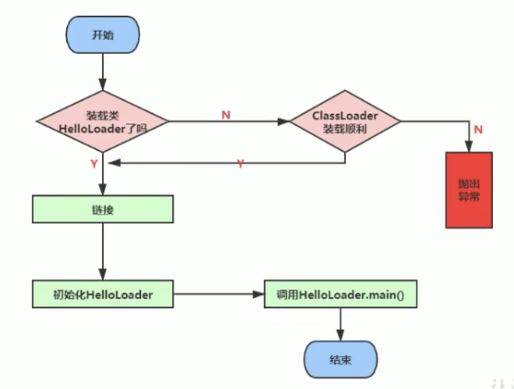

### 加载

1．通过一个类的全限定名获取定义此类的二进制字节流
2．将这个字节流所代表的静态存储结构转化为方法区的运行时数据结构
3．在内存中生成一个代表这个类的java.lang.Class对象，作为方法区这个类的各种数据的访问入口

**补充：加载.cIass文件的方式**

* 从木地系统中直接加载T
* 通过网络获取，典型场景：Web Applet
* 从zip缩包中读取，成为日后jar、war格式的基础
* 运行时计算生成，使用最多的是：动态代理技术
* 由其他文件生成，典型场景：JSP应用
* 从专有数据库中提取.class文件，比较少见
* 从加密文件中获取，典型的防Class文件被反编译的保护措施

### 链接

**1) 验证(Verify)**

* 目的在手确保Class文件的宇节流中包含信息符合当前虛拟机要求，保证被加载类的正确性，不会危害虛拟机自身安全。
* 主要包括四种验证，文件格式验证，元数据验证，字节码验证，符号引用验证。eg. 字节码验证需要以 `cafe babe` 开头（这 被成为魔术）

**2) 准备(Prepare)**

* 为类变量分配内存并且设量该类变量的默认初始值，即**零值**
* **这里不包含用final修饰的static，因为final在编译的时候就会分配了，准备阶段会显式初始化**
* **这里不会为实例变量分配初始化**，类变量会分配在方法区中，而实例变量是会随着对象一起分配到Java堆中

**3) 解析(Resolve)**

* 将常量池内的符号引用转换为直接引用的过程。可通过反编译查看：
  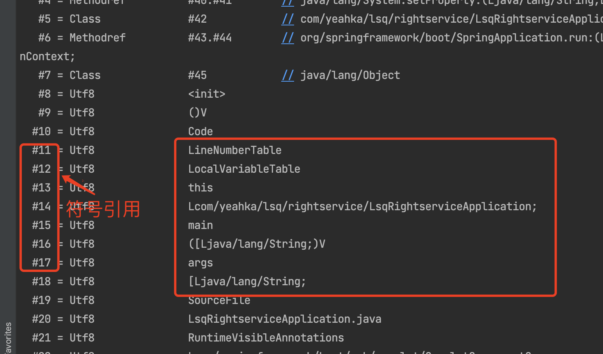
* 事实上，解析操作往往会伴随着`JVM`在执行完初始化之后再执行
* 符号引用就是一组符号来描述所引用的目标。符号引用的字面量形式明确定义在《java虛拟机规范》的`Class`文件格式中。直接引用就是直接指向目标的指针、相对偏移量或一个间接定位到目标的句柄
* 解析动作主要针对类或接口、字段、类方法、接口方法、方法类型等。对应常量池中的CONSTANT_Class_info、 CONSTANT_Fieldref_info、CNNSTANT_Methodref_info等

### 初始化(Initializaton)

tips：可以使用`idea`插件`Jclasslib`来查看字节码文件，以下展示截图：
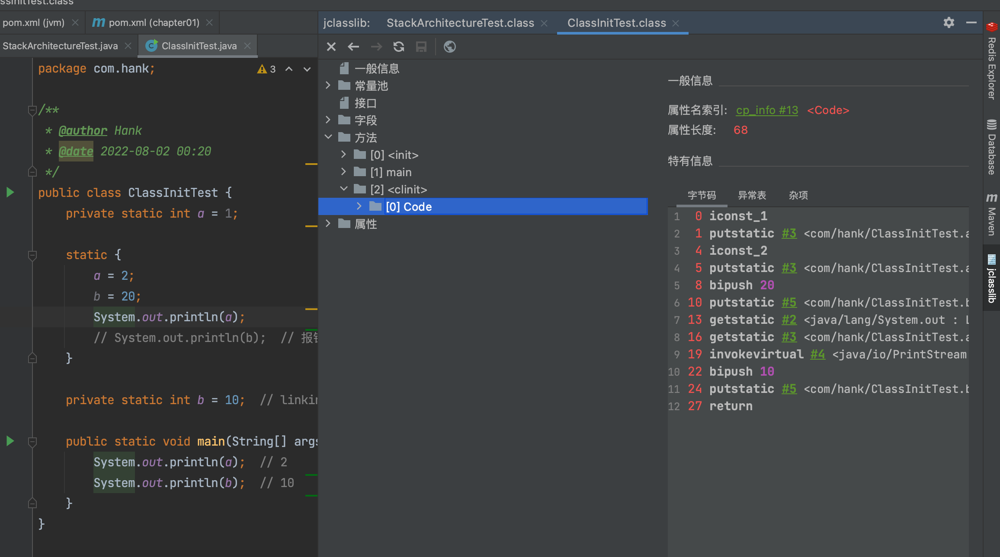

* **初始化阶段就是执行类构造器方法 `<clinit>()` 的过程。**

* 此方法不需定义，是`javac`编译器自动收集类中的**所有类变量的赋值动作和静态代码块中的语句**合并而来。

* 构造器方法中指令按语句在源文件中出现的顺序执行。
  ```java
  public class ClassInitTest {
      private static int a = 1;
  
      static {
          a = 2;
          b = 20;
          System.out.println(a);
          // System.out.println(b);  // 报错，非法的向前引用。可以赋值，但是不可以调用它
      }
  
      private static int b = 10;  // linking过程的prepare中会先对b赋零值：b = 0； 然后initialization初始化时按顺序赋值： 20 --> 10
  
      public static void main(String[] args) {
          System.out.println(a);  // 2
          System.out.println(b);  // 10
      }
  }
  ```

*  **`<clinit>()` 不同于类的构造器。**（关联：构造器是虛拟机视角下的`<init>()`)。不声明静态变量或static代码块，则类初始化时不会执行`<clinit>()`方法，如下图
  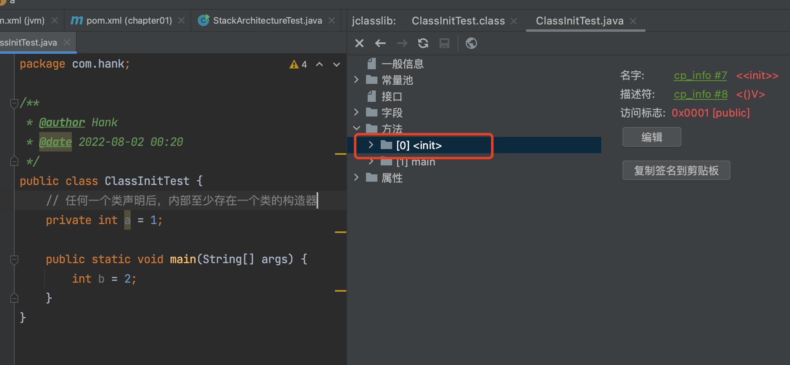

* 若该类具有父类，`JVM`会保证子类的 `<clinit>()` 执行前，父类的 `<clinit>()` 己经执行完毕。
  ```java
  public class ClassInitTest1 {
      static class Father {
          private static int A = 1;
  
          static {
              A = 2;
          }
      }
  
      static class Son {
          private static int B = Father.A;
      }
  
      public static void main(String[] args) {
          // 类初始化时，先加载父类Father，再加载子类Son，所以Father.A会先加载完
          System.out.println(Son.B);  // 结果是2
      }
  }
  ```

* 虚拟机必须保证一个类的 `<clinit>()` 方法在多线程下被同步加锁。
  ```java
  public class DeadThreadTest {
      public static void main(String[] args) {
          Runnable r = () -> {
              System.out.println(Thread.currentThread().getName() + "开始");
              DeadThread deadThread = new DeadThread();
              System.out.println(Thread.currentThread().getName() + "结束");
          };
  
          Thread thread1 = new Thread(r, "线程1");
          Thread thread2 = new Thread(r, "线程2");
          thread1.start();
          thread2.start();
          // 结果：DeadThread中static代码只加载一次
      }
  }
  
  class DeadThread {
      static {
          if (true) {
              System.out.println(Thread.currentThread().getName() + "初始化当前类");
              while (true) {}
          }
      }
  }
  ```


## 3.2 类的加载器分类

* `JVM`支持两种类型的类加载器，分别为引导类加载器 (`Bootstrap ClassLoader`）和自定义类加载器 (`User-Defined ClassLoader`)。
* 从概念上来讲，自定义类加载器，但是`Java`虚拟机规范却没有这么定义`ClassLoader`的类加载器都划分为自定义类加载器。
* 无论类加载器的类型如何划分，在程序中我们最常见的类加载器始终只有3个，如下所示：
  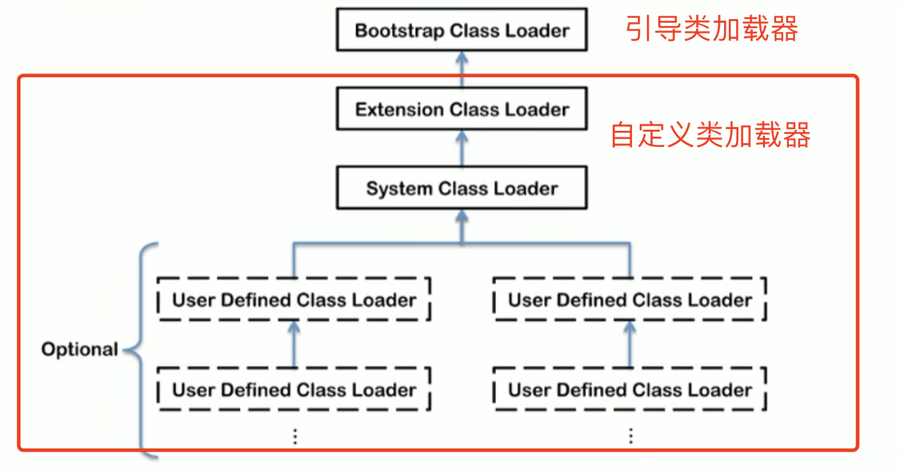

关于`ClassLoader`：
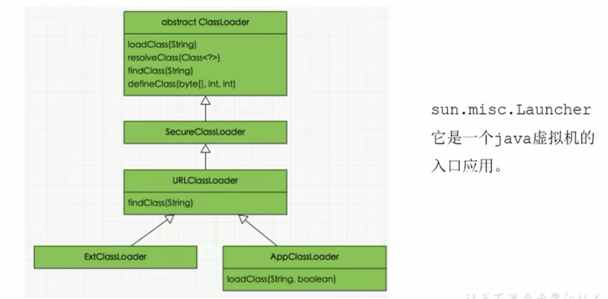

### 几种加载器使用体会

```java
public class ClassLoaderTest {
    public static void main(String[] args) {
        // 获取应用程序类加载器
        ClassLoader systemClassLoader = ClassLoader.getSystemClassLoader();
        System.out.println(systemClassLoader);  // sun.misc.Launcher$AppClassLoader@18b4aac2

        // 获取其上层：扩展类加载器
        ClassLoader extClassLoader = systemClassLoader.getParent();
        System.out.println(extClassLoader); // sun.misc.Launcher$ExtClassLoader@29453f44

        // 获取其上层：获取不到引导类加载器
        ClassLoader bootstrapClassLoader = extClassLoader.getParent();
        System.out.println(bootstrapClassLoader);   // null

        // 对于用户自定义来说：默认使用应用程序类加载器进行加载
        ClassLoader classLoader = ClassLoaderTest.class.getClassLoader();
        System.out.println(cla ssLoader);    // sun.misc.Launcher$AppClassLoader@18b4aac2

        // String类使用引导类加载器进行加载。 --> Java的核心类库都是使用引导类加载器进行加载
        ClassLoader stringClassLoader = String.class.getClassLoader();
        System.out.println(stringClassLoader);  // null
    }
}
```


### 虚拟机自带的类加载器

* 启动类加载器 Boostrap ClassLoader
  * 这个类加载使用**C/C++语言实现**的，嵌套在JVM内部。
  * 它用来加载Java的校心库 (JAVA HOME/ jre/1ib/rt.jar、resources.jar或sun.boot.class.path路径下的内容)，用于提供JVM白身盂要的类
  * 并不继承自java.1ang.classIoader，没有父加载器，
  * 加载扩展类和应用程序类加载器，并指定为他们的父类加载器。
  * 出于安全考虑，Bootstrap启动类加载器只加载包名为java、javax、sun等开头的类
* 扩展类加载器 Extension ClassLoader
  * **Java语言编写**，由sun.misc. Launcher$ExtClassIoader实现。
  * 派生于ClassIoader类
  * 父类加载器为启动类加载器
  * 从java.ext.dirs系统属性所指定的目录中加载类库，或从JDK的安装目录的jre/lib/ext子日录（扩展目录）下加载类库。**如果用户创建的JAR放在此目录下，也会自动由扩展类加载器加载**。
* 应用程序类加载器 AppClassLoader
  * java语言编写，由sun.misc. Launcher$AppClassIoader实现
  * 派生于classIoader类
  * 父类加载器为扩展类加载器
  * 它负责加载环境变量classpath或系统属性 java.class.path 指定路径下的类库
  * **该类加载是程序中默认的类加载器**，一般水说，Java应用的类都是由亡来完成加载
  * 通过ClassLoader#getsystemClassIoader （方法可以获取到该类加载器


### 用户自定义类加载器

在Java的日常应用程序开发中，类的加载几乎是由上述3种类加载器相互配合执行的，在必要时，我们还可以自定义类加载器，来定制类的加载方式。

**为什么要自定义类加载器？**

* 隔离加载类
* 修改类加载的方式
* 扩展加载源
* 防止源码泄漏

**用户自定义类加载器实现步骤：**

1. 开发人员可以通过继承抽象类java.lang.ClassIoader类的方式，实现自己的类加载器，以满足些特殊的需求
2. 在JDK1.2之前，在自定义类加载器时，总会去继承ClassIoader类并重写loadClass()方法，从而实现自定义的类加载类，但是在JDK1.2之后己不再建议用户去覆盖loadClass())方法，而是建议把自定义的类加载逻辑写在findClass()方法中
3. 在编写自定义类加载器时，如果没有太过于复杂的需求，可以直按继承URLClassIoader类，这样就可以避免自己去编写findClass()方法及其获取字节码流的方式，使自定义类加载器编写更加简洁。

```java
/**
 * @author Hank
 * @date 2022-08-31 23:55
 * 自定义类加载器
 */
public class CustomClassLoader extends ClassLoader {

    @Override
    protected Class<?> findClass(String name) throws ClassNotFoundException {
        byte[] classBytes = getClassBytesByName(name);
        if (classBytes != null) {
            return defineClass(name, classBytes, 0, classBytes.length);
        } else {
            throw new ClassNotFoundException();
        }
    }

    /**
     * 模拟通过自定义路径加载指定类文件字节
     */
    private byte[] getClassBytesByName(String name) {
        // 如果指定路径的字节码文件进行了加密，则需要在此方法中进行解密（防止源码泄漏可以做的动作）
        return null;
    }

    public static void main(String[] args) throws Exception {
        // 使用自定义类加载器加载
        CustomClassLoader customClassLoader = new CustomClassLoader();
        Class<?> test = Class.forName("Test", true, customClassLoader);
        Object obj = test.newInstance();
        System.out.println(obj.getClass().getClassLoader());
    }
}
```

### 关于ClassLoader

它是一个抽象类，其后所有的类加载器都继承自ClassLoader（不包括启动类加载器），自定义实现时，重写 `findClass` 和 `defineClass` 方法即可。

sun.misc.Launcher，它是一个Java虚拟机的入口应用

**获取ClassLoader的途径**

1. 获取当前类的ClassLoader
   ```java
   clazz.getClassLoader
   ```

2. 获取当前线程上下文的ClassLoader
   ```java
   Thread.currentThread().getContextClassLoader()
   ```

3. 获取系统的ClassLoader
   ```java
   ClassLoader.getSystemClassLoader()
   ```

4. 获取调用者的ClassLoader
   ```java
   DriverManager.getCallerClassLoader
   ```


## 3.3 双亲委派机制

Java虛拟机对class文件采用的是按需加载的方式，也就是说当需要使用该类时小会将它的class文件加载到内存生成class对象。而且加载某个类的class交件时，Java虛拟机采用的是双亲委派模式，即把请求交由父类处理，它是一种任务委派模式。

### 工作原理

1. 如果一个类加载器收到了类加载请求，它并不会自己先去加载，而是把这个请求委托给父类的加载器去执行；
2. 如果父类加载器还存在其父类加。载器，则进-一步向上委托，依次递归，。请求最终将到达顶层的启动类加载器；
3. 如果父类加载器可以完成类加载任务，就成功返回，倘若父类加载器无法完成此加载任务，子加载器才会尝试自己去加载，这就是双亲委派模式。

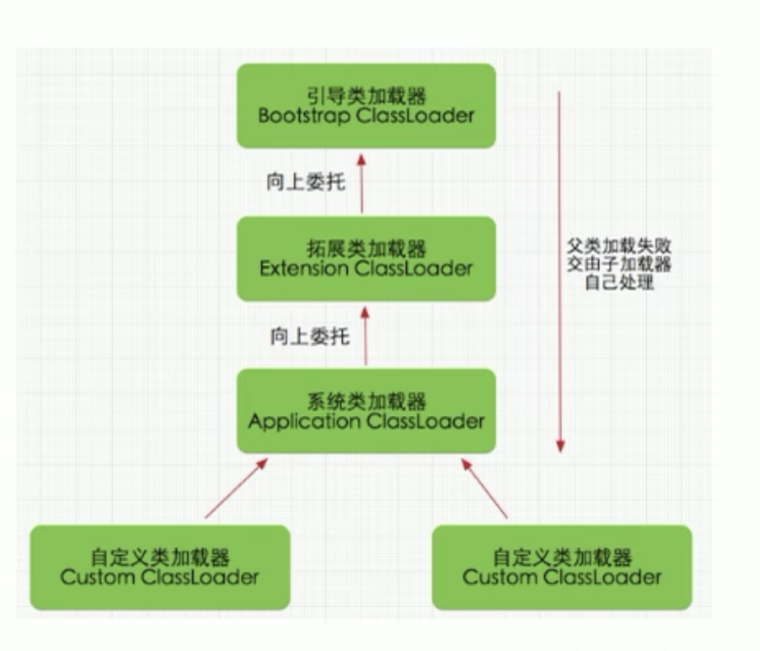


### 举例1

以下是自定义的 java.lang.String 类，无法执行main方法，实际项目中加载的不是这个自定义的类，而是引导类加载器加载的jdk种的String类

```java
package lang;

public class String {
    static {
        System.out.println("我是自定义String类的静态代码块");
    }

    // 无法执行，双亲委派模型，java.lang.String在引导类加载器中加载，是没有main方法的
    public static void main(String[] args) {
        System.out.println("hello, jvm");
    }
}
```


### 举例2

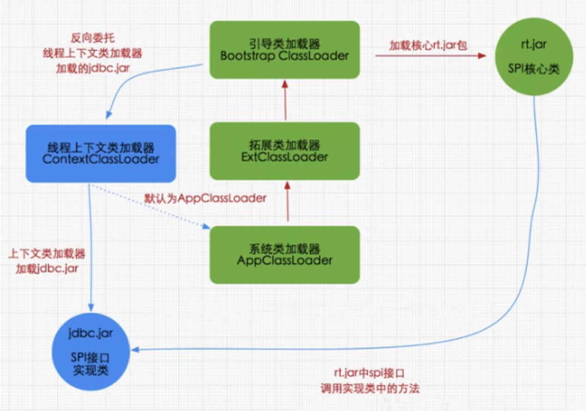

### 优势

* 避免类的重复加载

* 保护程序安全，防止核心AFI被随意篡改

  * 自定义类：java.lang.string

  * 自定义类：java.lang.HankStart
    ```java
    package lang;
    
    /**
     * @author Hank
     * @date 2022-09-02 00:01
     */
    public class HankStart {
    
        // 无法执行，报错：java.lang.SecurityException: Prohibited package name: java.lang
        public static void main(String[] args) {
            System.out.println("hello, jvm");
        }
    }
    
    ```

    提示：java.lang.SecurityException: Prohibited package name: iava.lang。 java开头的包由引导类加载器加载处理，是jdk的核心包，不允许用户采用此包名

### 沙箱安全机制

自定义String类，但是在加载自定义String类的时候会率先使用引导类加载器加载，而引导类加载器在加载的过程中会先加载jdk自带的文件(rt.jar包中java\lang\String.class)，报错信息说没有main方法，就是因为加载的是rt.jar包中的String类。这样可以保证对java核心源代码的保护，这就是**沙箱安全机制**。


## 3.4 其他

* 在JVM中表示两个class对象是否为同一个类存在必要条件：
  1. 类的完整类名必须一致，包括包名
  2. 加载这个类的ClassLoader（指ClassLoader示例对象）必须相
* 换句话说，在JVM中，即使这两个类对象（class对象）来源同一个class文件，被同一个虚拟机所加载，但只要加载它们的ClassLoader实 例对象不同，那么这两个类对象也是不相等的

**对类加载器的使用**

JVM必须知道一个类型是由启动类加载器加载的还是由用户类加载器加载的。如果一个类型是由用户类加载器加载的，那么JVN会将这个类加载器的一个引用作为类型信息的一部分保存在方法区中。当解析一个类型到另一个类型的引用的时候，JVN需要保证这两个类型的类加载器是相同的。

**Java程序对类的使用方式分为：主动使用和被动使用。**

* 主动使用，又分为七种情况：
  * 创建类的实例
  * 访问某个类或接口的静态变量，或者对该静态变量赋值
  * 调用类的静态方法
  * 反射（比如：Class.forName("com.hank.Test") ） 
  * 初始化-一个类的子类
  * Java虚拟机启动时被标明为启动类的类
  * JDK7 开始提供的动态语言支持：
    java.lang.invoke.MethodHandle实例的解析结果
    REF_getStatic、 REF_putStatic、 REF_invokeStatic句柄对应的类没有初始化，则初始化
*  除了以上七种情况，其他使用Java类的方式都被看作是对类的被动使用，
  都不会导致类的初始化。

# 4 运行时数据区及线程

## 4.1 概述

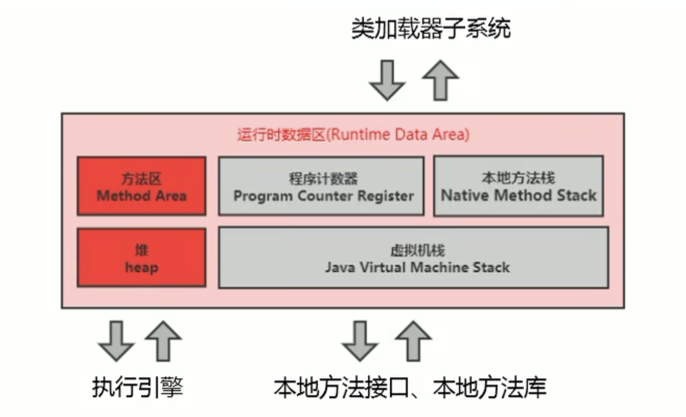

以下是阿里的划分 ：

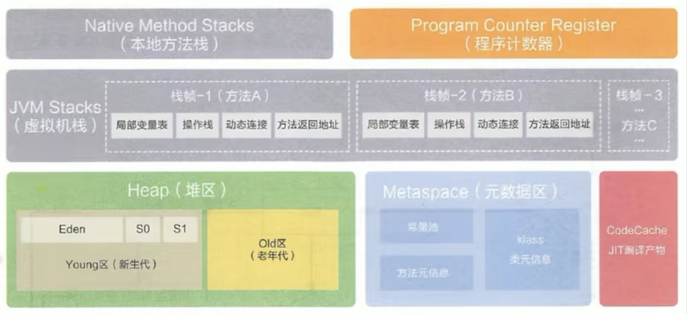

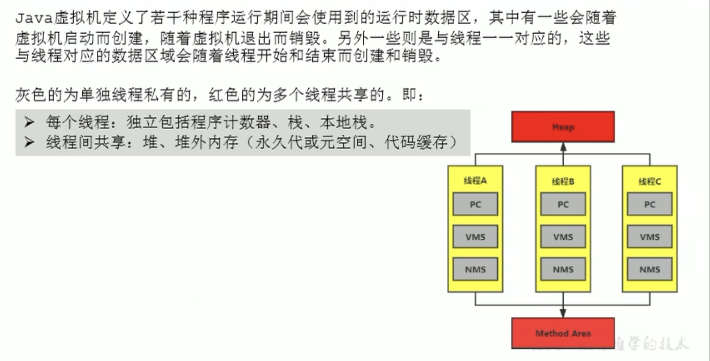

* 每个线程私有：**程序计数器、虚拟机栈、本地方法栈**
* 线程间共享：**堆、对外空间（永久代或元空间、代码缓存）**


## 4.2 线程

* 线程是一个程序里的运行单元。JVM允许一个应用有多个线程并行的执行。
* 在Hotspot JVM里，**每个线程都与操作系统的本地线程直接映射**。当一个Java线程准备好执行以后，此时一个操作系统的本地线程也同时创建。Java线程执行终止后，本地线程也会回收。
* 操作系统负责所有线程的安排调度到任何一个可用的CPU上。一旦本地线程初始化成功，它就会调用Java线程中的run()方法。
* PS：线程包含 **守护线程 和 普通线程**

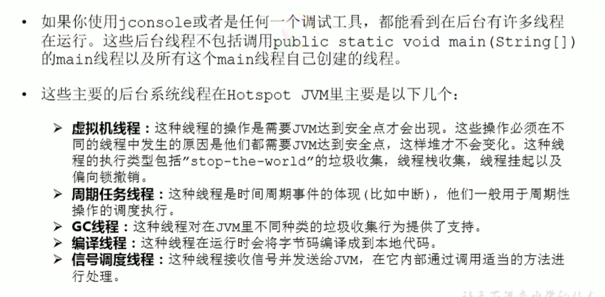


## 4.3 程序计数器 

### 4.3.1 PC Register介绍

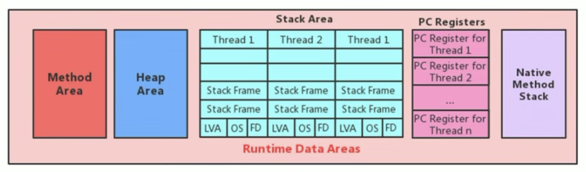

JVM中的程序计数寄存器(Program   Register）中， Register 的命名源于CPU的寄存器，寄存器存储指令相关的现场信息。CPU只有把数据装载到寄存器才能够运行。

这里，并非是广义上所指的物理寄存器，或许将其翻译为PC计数器 （或指令计数器）会更加贴切(也称为程序钩子），并且也不容易引起一些不必要的误会。**JVM中的PC寄存器是对物理PC寄存器的一种抽象模拟**。

**作用**

程序计数器用来存储指向下一条指令的地址，也即为将要执行的指令代码。由执行引擎读取下一条指令。

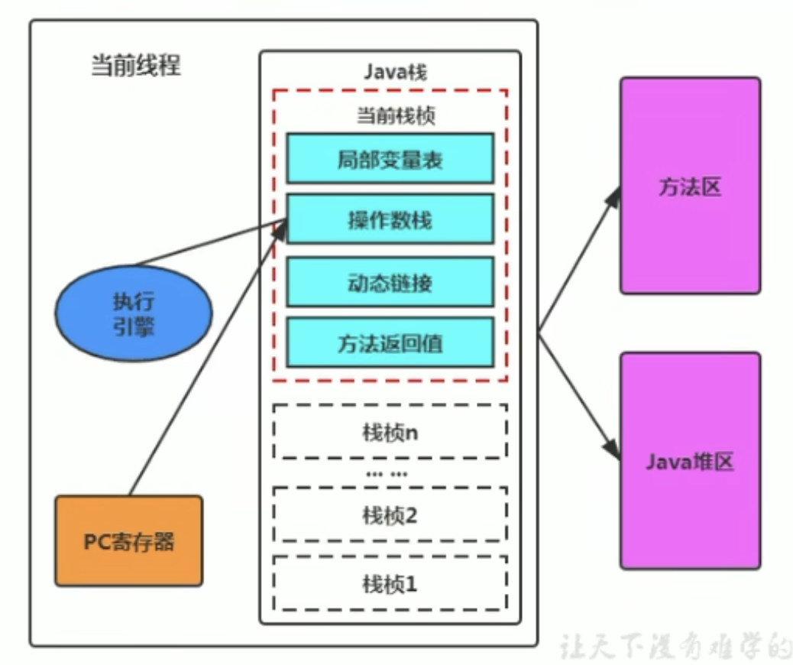

* 它是一块很小的内存空间，几乎可以忽略不计。也是运行速度最快的存储区域。
*  在JVM规范中，每个线程都有它自己的程序计数器，是线程私有的，生命周期与线程的生命周期保持一致。
* 任何时间一个线程都只有一个方法在执行，也就是所谓的当前方法。程序计数器会存储当前线程正在执行的Java方法的JVM指令地址；或者，如果是在执行native方法，则是未指定值 (undefined)。
* 它是**程序控制流的指示器，分支、循环、跳转、异常处理、线程恢复**等基础功能都需要依赖这个计数器来完成。
* 字节码解释器工作时就是通过改变这个计数器的值来选取下一条需要执行的字节码指令。
* **它是唯一一个在Java 虚拟机规范中没有规定任何OutOfMemoryError情况的区域**


### 4.3.2 举例说明

```java
public class ProgramCounterRegisterTest {
    public static void main(String[] args) {
        int i = 10;
        int j = 20;
        int k = i + j;

        String s = "ab";
        System.out.println(i);
        System.out.println(j);
    }
}

// 以下是字节码文件反编译后的部分结果：
 0: bipush        10
 2: istore_1
 3: bipush        20
 5: istore_2
 6: iload_1
 7: iload_2
 8: iadd
 9: istore_3
10: ldc           #2                  // String ab
12: astore        4
14: getstatic     #3                  // Field java/lang/System.out:Ljava/io/PrintStream;
```

结果分析：

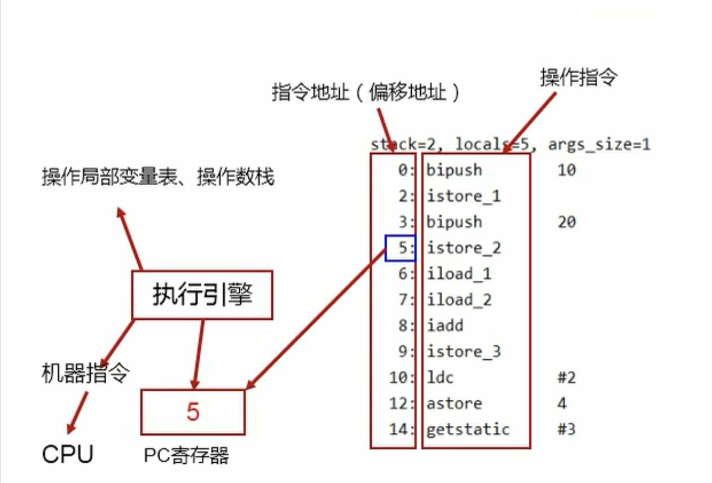


### 4.3.3 两个问题

**一：**
**使用程序计数器存储字节码指令地址有什么用呢？**
**为什么要使用程序计数器存储字节码指令地址呢？**

答：

* **因为CPU需要不停的切换各个线程，这时候切换回来以后，就得知道接着从哪开始继续执行。**
* JVM的字节码解释器就需要通过改变PC寄存器的值来明确下一条应该执行什么样的字节码指令。

**二：程序计数器为什么被设定为线程私有？**

答：

* 我们都知道所谓的多线程在一个特定的时间段内只会执行其中某一个线程的方法，CPU会不停地做任务切换，这样必然导致经常中断或恢复，如何保证分毫无差呢？**为了能够准确地记录各个线程正在执行的当前字节码指令地址，最好的办法自然是为每一个线程都分配一个PC寄存器**，这样一来各个线程之间便可以进行独立计算，从而不会出现相互干扰的情况。
* 由于CEU时间片轮限制，众多线程在并发执行过程中，任何一个确定的时刻，一个处理器或者多核处理器中的一个内核，只会执行某个线程中的一条指令。
* 这样必然导致经常中断或恢复，如何保证分毫无差呢？每个线程在创建后，都会产生自己的程序计数器和栈帧，程序计数器在各个线程之间互不影响。

**CPU时间片**

* CPU 时间片即 CPU 分配给各个程序的时间，每个线程被分配一个时间段，称作它的时间片。
* 在宏观上：我们可以同时打开多个应用程序，每个程序并行不悖，同时运行。
* 但在微观上：由于只有一个CPU，一次只能处理程序要求的一部分，如何处理公平，种方法就是引入时间片，每个程序轮流执行。


 **扩展概念：并行和并发**

* 并行：与串行对应
* 并发：（不会产生Stop The World）

 个人理解：并行是指**某一时刻**同时运行，并发是指**单位时间**内看起来是在并行，实际上只是CPU快速切换的宏观表现，底层还是串行。一个是某一时刻，一个是单位时间内

# 5 虚拟机栈

## 5.1 概述

由于跨平台性的设计，Java的指令都是根据栈来设计的。不同平台CPU架构不同，所以不能设计为基于奇存器的。

优点是**跨斗台，指令集小，编译器容易实现**，缺点是**性能下降，实现同样的功能需要更多的指**令。

**栈是运行时的单位，而堆是存储的单位**
即：栈解决程序的运行问题，即程序如何执行，或者说如何处理数据。堆解決的是数据存储的问题，即数据怎么放、放在哪儿


### Java虚拟机栈是什么？

* Java虛拟机栈 (Java Virtual Machine Stack)，早期也叫Java栈。每个线程在创建时都会创建一个虛拟机栈，其内部保存一个个的栈帧(Stack Frame ），对应着一次次的Java方法调用。**一个栈帧对应着一个方法**
* 是线程私有的

### 生命周期

生命周期和线程一致

### 作用

主管Java程序的运行，它保存方法的**局部变量（8中基本数据类型、对象 引用地址）**、部分结果，并参与方法的调用和返回。

扩展：关于变量

* 局部变量 VS 成员变量（属性） 
* 基本数据类型变量 VS 引用类型变量（类、数组、接口）

### 栈的特点

* 后进先出（**LIFO**: last in first out）
* 栈是一种快速有效的分配存储方式，访问速度仅次于程序计数器。
* JVM直按对Java栈的操作只有两个：
  	1. 每个方法执行，伴随着进栈（入栈、压栈）
  	1. 执行结束后的出栈工作
* 对于栈水说不存在垃圾回收问题

### 面试题：开发中常遇到的异常有哪些？

* `StackOverFlowError`
* `OutOfMemoryError`

### 栈中可能出现的异常

Java 虚拟机规范允许**Java栈的大小是动态的或者是固定不变**的。

* 如果采用固定大小的Java虛拟机栈，那每一个线程的Java虛拟机栈容量可以在线程创建的时候独立选定。如果线程请求分配的栈容量超过Java虚拟机栈允许的最大容量，Java虚拟机将会抛出一个`StackOverFlowError` 异常。
* 如果Java虚拟机栈可以动态扩展，并且在尝试扩展的时候无法申请到足够的内存，或者在创建新的线程时没有足够的内存去创建对应的虚拟机栈，那Java虚拟机将会抛出一个`OutOfMemoryError` 昇常。

### 设置栈内存大小

我们可以使用参数-Xss 选项来设置线程的聂大栈空间，栈的大小直接决定了函数调用的最大可达深度。

```shell
-Xss256k
```

## 5.2 栈的存储单位

* 每个线程都有自己的栈，栈中的数据都是以栈帧（Stack Frame）的格式存在。
* 在这个线程上正在执行的每个方法都各自对应一个栈帧 (Stack Frame)。
* 栈帧是一个内存区块，是一个数据集，维系着方法执行过程中的各种数据信息。
* JVM直接对Java栈的操作只有两个，就是对栈帧的压栈和出栈，遵循“**先进后出**” /“**后进先出**” 原则。
* 在一条活动线程中，一个时间点上，只会有一个活动的栈帧。即只有当前正在执行的方法的栈帧（**栈顶栈帧**）是有效的，这个栈帧被称为**当前栈帧**（Current Frame），与当前栈帧相对应的方法就是**当前方法**（Current Method），定义这个方法的类就是**当前类** （Current Class）
* 执行引擎运行的所有字节码指令只针对当前栈帧进行操作。
* 如果在该方法中调用了其他方法，对应的新的栈帧会被创建出来，放在栈的顶端，成为**新的当前帧**。
* 不同线程中所包含的栈帧是不允许存在相互引用的，即不可能在一个栈帧之中引用另外一个线程的栈帧。
* 如果当前方法调用了其他方法，方法返回之际，**当前栈帧会传回此方法的执行结果给前一个栈帧**，接着，**虛拟机会丢弃当前栈帧，使得前一个栈帧重新成为当前栈帧**。
* Java方法有两种返回函数的方式，**一种是正常的函数返回，使用return指令；另外一种是拋出异常。不管使用哪种方式，都会导致栈帧被弹出**。

### 栈运行原理

遵循“**先进后出**” /“**后进先出**” 原则 

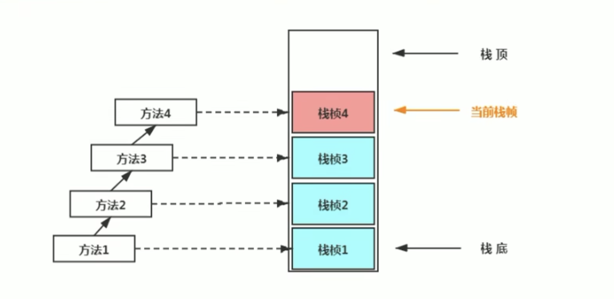

**栈运行时debug观察方法调用** 
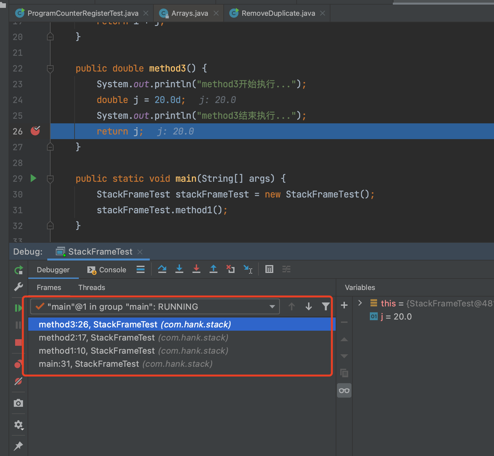


## 5.3 局部变量表

## 5.4 操作数栈

## 5.5 代码追踪

## 5.6 栈顶缓存技术

## 5.7 动态链接

## 5.8 方法的调用：解析与分派

## 5.9 方法返回地址

## 5.10 一些附加信息

## 5.11 栈的相关面试题


# Tips

* 引用计数法在Python中使用，并没有在Java中使用


# 附录 部分命令总结

* 反编译
  ```shell
  javap -v xxx.class
  ```

  

